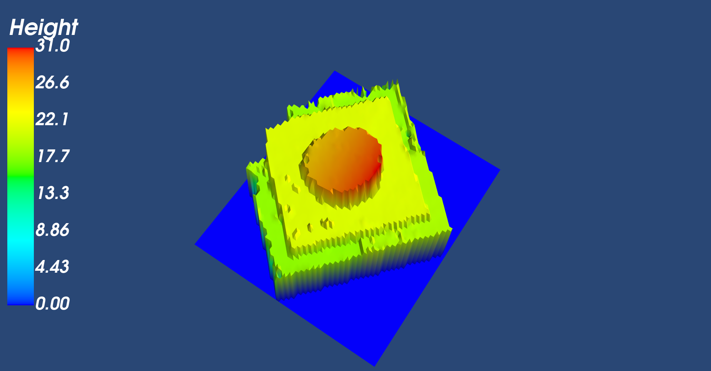
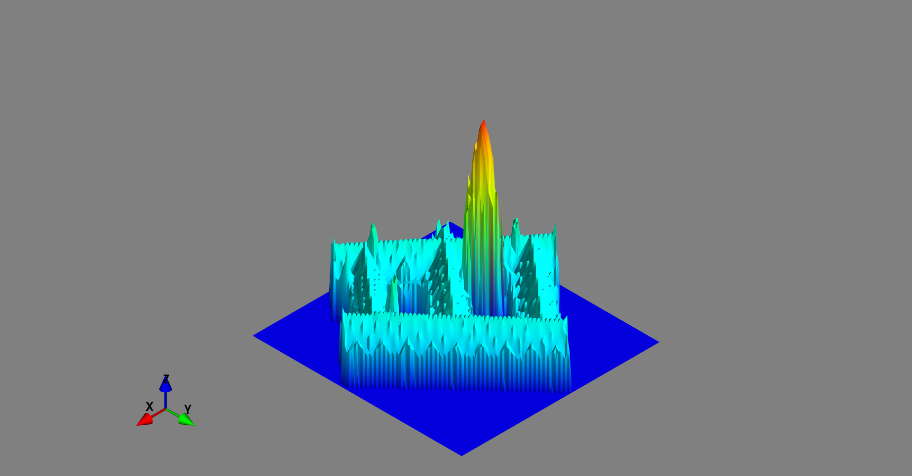
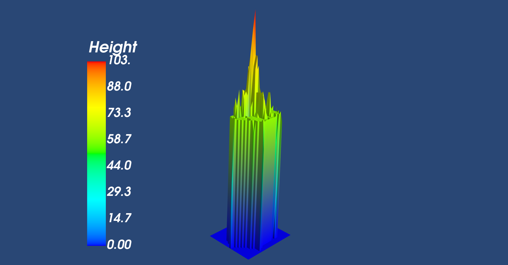

# 3D-Houses-Project

## Description
This project is a challange to model a house in 3D with given only a home adress in Flanders, Belgium. The objectives are consolidate the knowlege in Python, specifically in :

 * NumPy
 * Pandas
 * Matplotlib and 
 * Other necessary libraries

Duration of the project: 2 weeks

## Learning Objectives

- to be able to search and implement new libraries
- to be able to read and use the shapefile format
- to be able to read and use geoTIFFs
- to be able to render a 3D plot
- to be able to present a final product

## The Mission

 _LIDAR PLANES_, are active in the Geospatial industry. They would like to use their data to launch a new branch in the insurance business. So, want to build a solution with the data to model a house in 3D with only a home address.

### Must-have features

- 3D lookup of houses.

### Nice-to-have features

- Optimize your solution to have the result as fast as possible.
- Features like the living area of the house in m², how many floors, if there is a pool, the vegetation in the neighborhood, etc...
- Better visualization.

## Installation
The environment at which the code is developed is provided in the `requirements.txt` file. To run the code, the necessary libraries should be installed  based on that environment. Important libraries are, among others:

  *  Numpy
  *  Pandas
  *  Geopandas
  *  Rasterio and Rioxarray
  *  Nominatim from geopy.geocoders
  *  Shapely
  *  Mayavi
 
## Usage
The code has two files named: `GeoTiff_Bounds_csv.ipynb` and `Location_to_3D`. 
  

  * _GeoTiff_Bounds_csv.ipynb_ uses `rasterio` to collect the bound data from the DSM (Digital Surface Map) and DTM (Digital Terrain Map). These raster images are already computed and available in [DSM](http://www.geopunt.be/download?container=dhm-vlaanderen-ii-dsm-raster-1m&title=Digitaal%20Hoogtemodel%20Vlaanderen%20II,%20DSM,%20raster,%201m) and [DTM](http://www.geopunt.be/download?container=dhm-vlaanderen-ii-dtm-raster-1m&title=Digitaal%20Hoogtemodel%20Vlaanderen%20II,%20DTM,%20raster,%201m). It accesses the zip files, collects the bound data (`left, bottom, right and top` values) of the tif files and saves them to the bound_data.csv file.

  * _Location_to_3D.ipynb_ recieves the home address (in flanders) does the following:

    1. Reads the csv file containing the data of bounds values of the raster images and cleans the data
 2. Using Nominatim, it gets the coordinates of the area of interest directly in crs EPSG:31370 
 3. Uses conditions to search the raster file where the area of interest/ the house is located
 4. Accesses the DSM and DTM Geotiff images corresponding to the area of interest and clip them with the polygon of the house using rasterio (with out downloading the files). Gets the clipped CHM array
 5. Plots the 3D image with mayavi
## Visuals
Sample visuals of some houses here :

## Validation
 The Leuven Library tower located at _Monseigneur Ladeuzeplein 21, 3000 Leuven_ was finalised in 1928 wa built to replace an earlier historic library that was destroyed during the first world war. According to the [Leuven libraries website](https://bib.kuleuven.be/english/about/hIistory-tourism), its height is 80 m. Th height of the model is 78.39 m. The error margin is about 2m.

## Further Development
The nice to have features are not yet implemented.